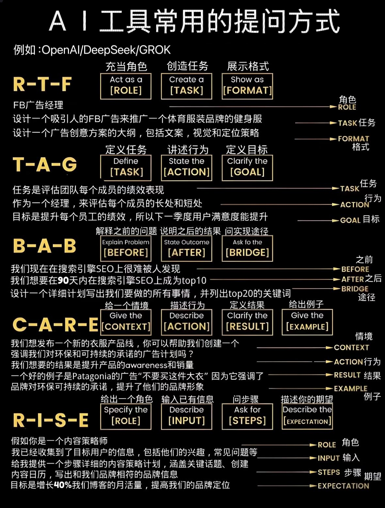

# 方法论
## 1. STAR 法则
    Situation（情境）：事件发生的背景
    Task（任务）：你的目标或角色
    Action（行动）：具体采取的措施
    Result（结果）：量化成果（如节省成本、提升效率等）

## 2. 问题-方法-结果（PSI, Problem-Solution-Impact）
    Problem（问题）：遇到的核心挑战
    Solution（方法）：解决策略
    Impact（结果）：带来的实际效果
    
## 3. CAR（Challenge-Action-Result，挑战-行动-结果）
    Challenge（挑战）：问题的难度或特殊性
    Action（行动）：你采取的独特措施
    Result（结果）：可量化的成功

## 4. SMART 法则（目标导向写法）
    Specific（具体）：目标清晰明确
    Measurable（可衡量）：有量化指标
    Achievable（可实现）：现实可行
    Relevant（相关性）：与核心目标一致
    Time-bound（有时限）：有截止日期

## 5. FAB 法则（卖点突出写法）
    Feature（特征）：产品 / 能力的属性
    Advantage（优势）：与竞品的差异点
    Benefit（利益）：给客户带来的价值

## 6. SCQA（咨询式写法，适合高级岗位）
    Situation（情境）：现状描述
    Complication（冲突）：潜在矛盾或问题
    Question（问题）：核心挑战是什么
    Answer（答案）：解决方案

## AI提问
