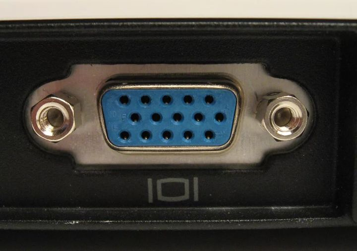
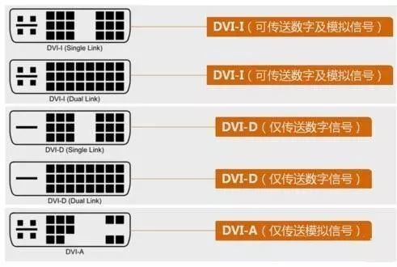
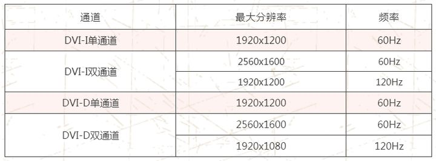
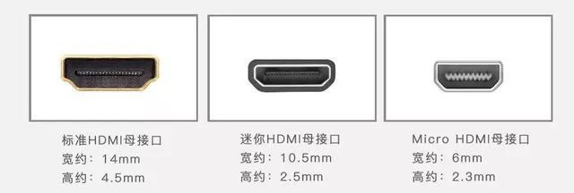
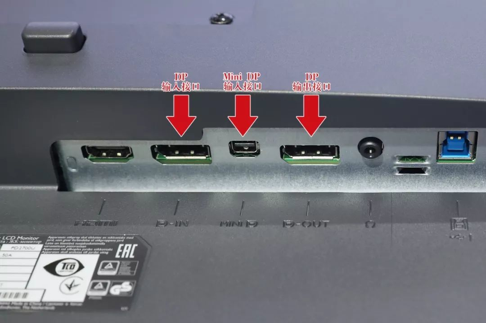

## 显示接口
从发展路径上来讲，HDMI 的数字信号标准是继承 DVI 接口的，DVI 转 HDMI 的转接头内部甚至不需要带有计算能力的芯片。DVI 接口的模拟部分又是继承自VGA的，DVI 的数字部分还是像 VGA 一样提供时序来扫描。
### 蓝色VGA
5*3针，模拟协议。（通过A/D模拟器可将起信号转为数电），由于线材与信号干扰等一系列问题，VGA使用时一般仅能够达到1080p分辨率。

### 白色DVI

### HDMI
HDMI接口在2002年提出，现在已经发展到HDMI 2.1标准，而且随着行业发展，HDMI 2.1标准已经能够支持4K 120Hz及8K 60Hz，支持高动态范围成像（HDR），可以针对场景或帧数进行优化，向后兼容HDMI 2.0、HDMI 1.4。最主要的是，它是视音频同时传输的。

### DP
数字信号标准完全新创，采用了计算机领域常用的分组转发/按包发送的策略，可以非常简单的进行软件升级，可扩展性强。
支持：4K 120Hz视频，也可以支持8K 60Hz，DP1.4兼容USB Type-C接口，这就意味着，我们可以使用DP1.4协议，在USB 3.1传输数据的同时，同步传输高清视频。

