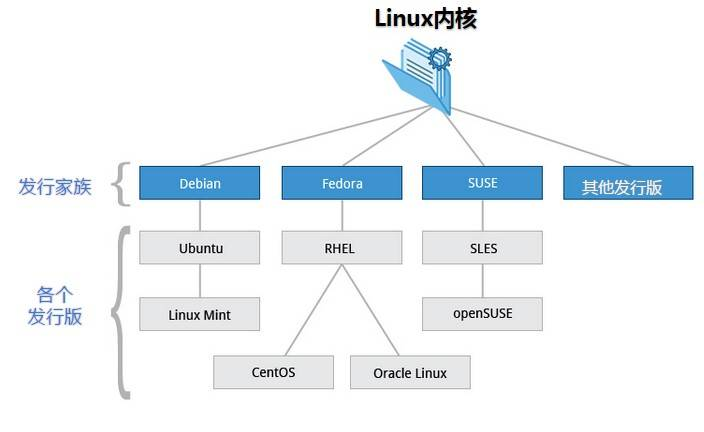
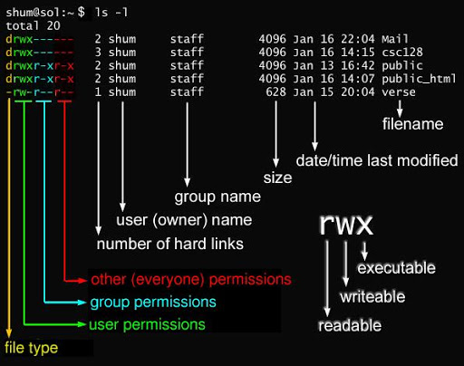

# 简介
Linux 遵循 GNU 通用公共许可证（GPL）


# Linux 系统启动过程
```
内核的引导 
    BIOS开机自检
    接管硬件
    读入/boot
运行 init
    首先是需要读取配置文件 /etc/inittab
    "运行级别"（runlevel）
        运行级别0：系统停机状态，系统默认运行级别不能设为0，否则不能正常启动
        运行级别1：单用户工作状态，root权限，用于系统维护，禁止远程登录
        运行级别2：多用户状态(没有NFS)
        运行级别3：完全的多用户状态(有NFS)，登录后进入控制台命令行模式
        运行级别4：系统未使用，保留
        运行级别5：X11控制台，登录后进入图形GUI模式
        运行级别6：系统正常关闭并重启，默认运行级别不能设为6，否则不能正常启动
系统初始化
    *init程序会执行  si::sysinit:/etc/rc.d/rc.sysinit
    *rc.sysinit是每一个运行级别都要首先运行的重要脚本。它主要完成的工作有：激活交换分区，检查磁盘，加载硬件模块以及其它一些需要优先执行任务。
    *启动service或者daemon
建立终端
用户登录系统
```
# 系统目录

权限

# 文件基本属性 

```
当为 d 则是目录
当为 - 则是文件；
若是 l 则表示为链接文档(link file)；
若是 b 则表示为装置文件里面的可供储存的接口设备(可随机存取装置)；
若是 c 则表示为装置文件里面的串行端口设备，例如键盘、鼠标(一次性读取装置)。
```
# 磁盘管理
```
df

du

fdisk

如何挂盘？
```