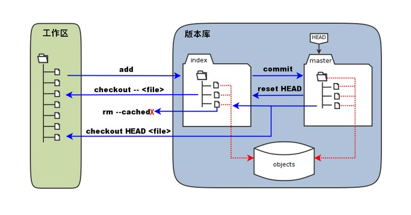

# git
```
.git/
|-- HEAD            # 当前分支的引用
|-- config           # 存储仓库的配置信息
|-- info/
|   `-- exclude     # 定义全局忽略规则
|-- hooks/
|   |-- pre-commit   # 提交前运行的钩子脚本
|   |-- post-checkout # 检出后运行的钩子脚本
|   `-- ...
|-- objects/        # 存储所有对象（提交、树、blob）
|   |-- [a-z0-9]/   # 对象存储在 SHA-1 哈希目录结构中
|   `-- info/
|       `-- [pack]  # 打包的对象
|-- refs/                ## （git branch /  git checkout)
|   |-- heads/      # 分支的引用
|   |   `-- master  # master 分支的引用
|   `-- tags/      # 标签的引用
|       `-- v1.0    # v1.0 标签的引用
`-- logs/
    `-- refs/
        |-- heads/   # 分支的日志
        |   `-- master # master 分支的日志
        `-- tags/    # 标签的日志
            `-- v1.0   # v1.0 标签的日志
```


## git log 
```
查看文件在哪些分支上修改
git log --follow -- build.sh

git log --graph
git log --author="thinban" --since="2023-04-01" --until="2025-05-03" -- build.sh 
```
## git show
```
git show --stat ff664ea1dfb61d4c141c3753c99d8ccec911e42c
(git show HEAD)
git show ff664ea1dfb61d4c141c3753c99d8ccec911e42c --  build.sh 
```
## git ignore
如果某些文件已经被纳入了版本管理中，则修改.gitignore是无效的。
```
git rm -r --cached .
git add .
git commit -m 'update .gitignore'
```


## 创建代码仓库
```
mkdir my-repo.git
cd my-repo.git
git init --bare

```

## 其他
```
重置当前分支到特定的状态：
git reset --hard [提交哈希]

查看两个分支的差异：
git diff [分支1] [分支2]

修改最近的一次提交：
git commit --amend

交互式地选择文件添加到索引：
git add -i

交互式地暂存或取消暂存更改：
git stash
git stash pop

查看所有引用（分支、标签）指向的提交：
git reflog

配置
git config --global user.name "thinban"
git config --global user.email "thinban@mail.com"
```
