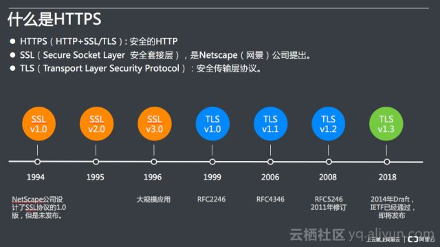
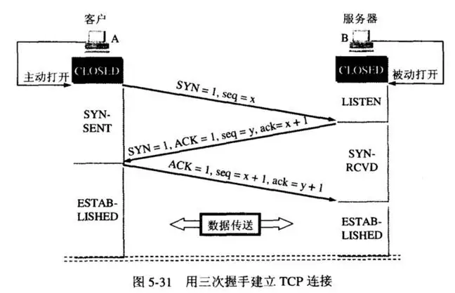
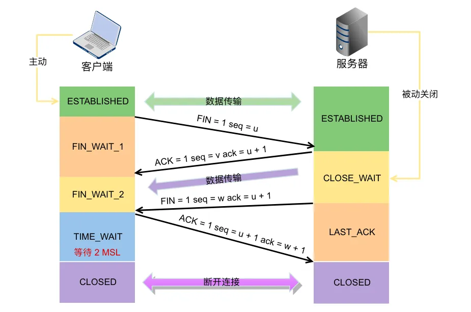
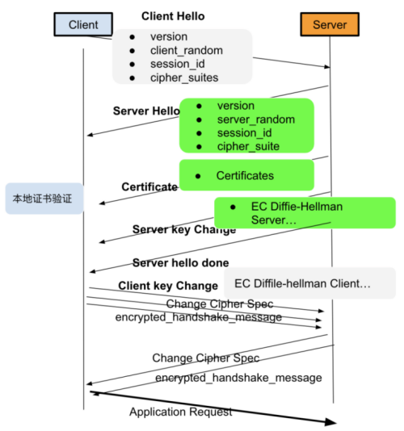
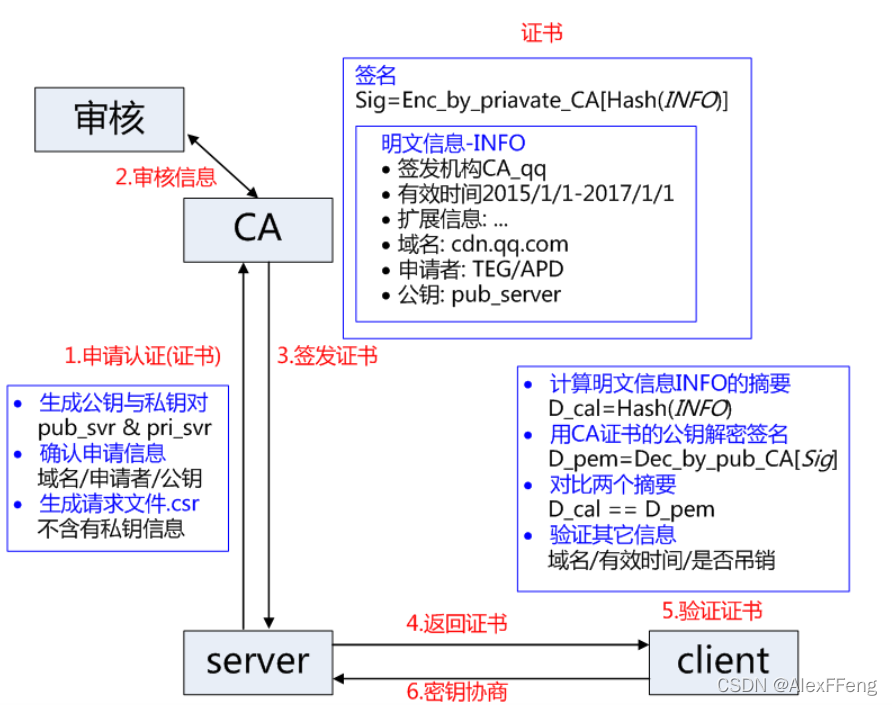
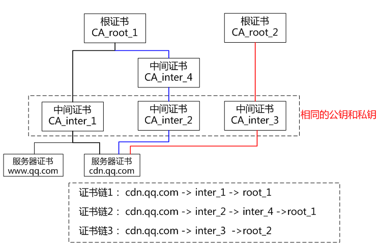
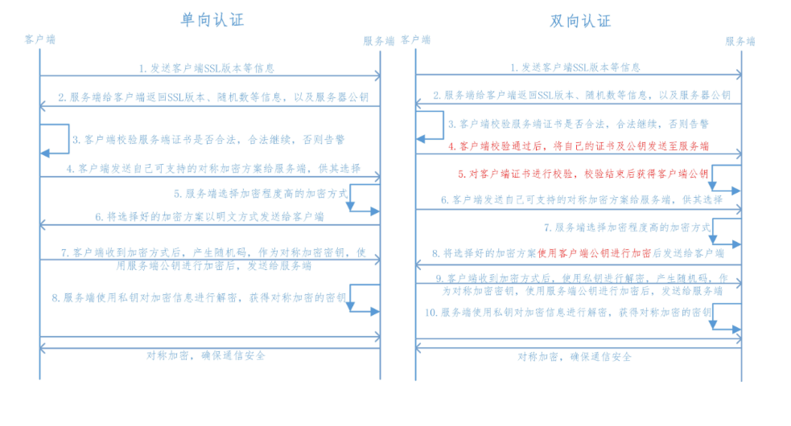

## 网络模型

应用层-->传输层-->Ip层-->链路层

你好！==>app_你好==>tcp_app_你好==>ip_tcp_app_你好==>帧头_ip_tcp_app_你好==>网卡==>路由

## HTTPS
[爱奇艺海外版HTTPS效率是如何提升](https://mp.weixin.qq.com/s/9YgE_no2JmFilzJal_KzEg)

TLS: transport layer security

SSL(前身): secure sockets layer



### HTTPS之10个RTT 
```text
    1. DNS
        本地缓存
        HTTPDNS 预解析
        
	2. *TCP握手
	
	3. HTTPS重定向
		浏览器声明了HSTS,可以省略 302 转向
		
	4. HTTPS TCP 握手
	
	5. *TLS握手Hello
	
	6. CA证书验证：DNS
		CA DNS 缓存
		
	7. CA证书验证：TCP握手
	
	8. CA证书验证：OSCP
		CA 本地有验证缓存或者启用 OCSP Stapling 的本地验证
		
	9. *TLS握手 密钥交换
	
	10. *HTTPS内容请求
	
ps：（*表示有各类缓存情况下，一个常规的 HTTPS 请求会保留的 4 个 RTT 流程。）
```

## TCP连接和断开连接





## TLS通信流程



### 证书签发、使用和吊销

X.509 标准规定数字证书应包含标准化信息。

通用的证书格式：
- key（私钥，pri_svr）
- csr（向CA发起的证书申请请求）
- crt（ca签发的证书文件）。

证书类型： 
- DV(domain validation,不支持多泛域名)
- OV(organization validation)
- EV(extended validation，地址栏上显示组织机构的名称，贵、不支持多域名、泛域名）



#### 证书吊销

CRL（ Certificate Revocation
List）是CA机构维护的一个已经被吊销的证书序列号列表，浏览器需要定时更新这个列表，浏览器在验证证书合法性的时候也会在证书吊销列表中查询是否已经被吊销，如果被吊销了那这个证书也是不可信的。可以看出，这个列表随着被吊销证书的增加而增加，列表会越来越大，浏览器还需要定时更新，实时性也比较差。

OCSP （Online Certificate Status Protocol）在线证书状态协议，去CA服务器实时校验一下证书有没有被吊销就，这个协议就是解决了 CRL 列表越来越大和实时性差的问题而生的，但性能差。

#### 证书链

证书链有以下特点：
- a.同一本服务器证书可能存在多条合法的证书链。
因为证书的生成和验证基础是公钥和私钥对，如果采用相同的公钥和私钥生成不同的中间证书，针对被签发者而言，该签发机构都是合法的 CA，不同的是中间证书的签发机构不同;
- b.不同证书链的层级不一定相同，可能二级、三级或四级证书链。
中间证书的签发机构可能是根证书机构也可能是另一个中间证书机构，所以证书链层级不一定相同。



#### 双向验证




